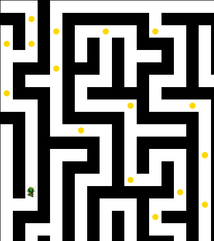

# Game Maze React

## Description

*Game Maze* is an engaging and thrilling adventure game that takes players on an unforgettable journey through a mystic world filled with puzzles, enemies, and hidden treasures. Players control a brave hero, navigating through intricate mazes, battling formidable foes, and collecting valuable bonuses to enhance their abilities. The game features dynamic gameplay, responsive controle.

## Key Features

- **Dynamic Mazes**: Explore ever-changing mazes filled with traps, secrets, and obstacles.

## How to Play

- **Movement**: Use the arrow keys (↑, ↓, ←, →) to navigate through the maze.
- **Collect Items**: Walk over items to collect them.
- **Combat**: Approach enemies to engage in combat, strategically utilizing your collected power-ups.
- **Objective**: Reach the end of each maze to advance to the next level, aiming to complete all levels and uncover the game's final mystery.

## Screenshot

Here's a glimpse of the game's interface:

*Screenshot description*: This image showcases the game's main interface, featuring the hero navigating through a maze, collecting bonuses, and avoiding enemies.